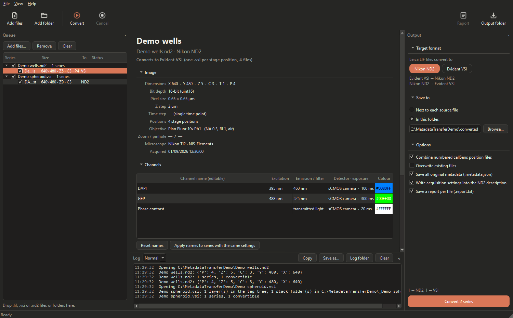
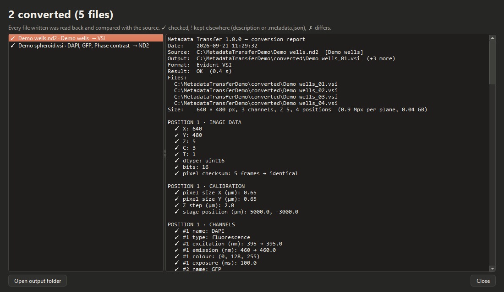

# Metadata Transfer

Converts microscopy files between **Leica LIF**, **Evident/Olympus cellSens VSI** and **Nikon
NIS-Elements ND2**, with their metadata, so an acquisition from one microscope opens as a proper
multidimensional dataset in another vendor's software. Pixels are copied unchanged, and every file
written is read back and compared with the source.

Developed by the BIOMIS Team, SATIE laboratory, ENS Paris-Saclay · version 1.0.0 · GPL-3.0-or-later ·
for research use only; not for diagnostic or clinical use.

> This project is independent: it is not affiliated with, endorsed by or supported by Nikon, Evident
> (Olympus) or Leica Microsystems. NIS-Elements, cellSens, OlyVIA and LAS X are trademarks of their owners.



## Download for Windows

| File | What it is |
|---|---|
| [Metadata-Transfer-Setup.exe](../../releases/latest/download/Metadata-Transfer-Setup.exe) | Installer (Windows 10/11, 64-bit, per user, no administrator rights) |
| [Uninstall-Metadata-Transfer.exe](../../releases/latest/download/Uninstall-Metadata-Transfer.exe) | Standalone uninstaller |
| [Metadata-Transfer-Windows.zip](../../releases/latest/download/Metadata-Transfer-Windows.zip) | Both, with README.txt, checksums and licences |

The links point to the latest release on the Releases page. The installer is not code-signed:
Windows SmartScreen may say "Windows protected your PC"; click **More info → Run anyway**.

## What it does

| From | To | How |
|---|---|---|
| Leica LIF (LAS X) | Nikon ND2 **or** Evident VSI | each series → one file |
| Evident VSI (cellSens) | Nikon ND2 | each layer → one file; layers that are one acquisition (e.g. fluorescence + DIC) → one multichannel file; numbered position files (`name_01.vsi`, `name_02.vsi`, …) → **one ND2 with an XY loop** |
| Nikon ND2 (NIS-Elements) | Evident VSI | one `.vsi` + `_name_` folder; multipoint ND2 → one numbered `.vsi` per position, the way cellSens stores multi-position experiments |

Dimensions X, Y, Z, channels, time and stage positions; pixel size, Z step, time step and per-frame
times; channel names, excitation/emission, colours and transmitted/fluorescence type; objective
(name, magnification, NA, immersion); camera and exposure; acquisition date; stage positions.
What a target format has no field for goes into the ND2 description and the `.metadata.json` sidecar
(the complete original metadata). Field by field: [docs/mapping_table.md](docs/mapping_table.md).

Stitched cellSens overview images are pyramids: pick the resolution to convert (full resolution
works for multi-GB planes; they are streamed, not loaded). Large images written to VSI get tiles and
a pyramid, so OlyVIA can zoom.

## Install and uninstall

1. Run `Metadata-Transfer-Setup.exe` (or unpack the zip and run it from there).
2. Start **Metadata Transfer** from the Start menu or the desktop shortcut.
3. A newer version installs over an older 1.x and keeps your settings and channel-name presets
   (`%APPDATA%\Metadata Transfer`). The earlier builds 0.1 and 0.2 are separate programs; remove
   them in Settings → Apps if you no longer need them.

Uninstall in Settings → Apps → Metadata Transfer, or with `Uninstall-Metadata-Transfer.exe`.
Converted files are never touched; settings are kept unless you tick "Also remove my settings".

## Quick start

1. **Add files**: drag `.lif`, `.vsi` or `.nd2` files (or folders) onto the window, or click
   *Add microscope files…*. For `.vsi`, the folder `_name_` next to the file holds the pixels and is
   found automatically.
2. Each file expands into its series. Untick what you do not want. Series that cannot be converted
   are greyed out with the reason.
3. Click a series to check its metadata. Channel names can be edited; save them as a preset or copy
   them to every series recorded with the same settings.
4. In **Output**, choose where Leica files go (ND2 or VSI), where to save, and click **Convert**.
5. The report lists every check: ✓ transferred and verified, ! kept in the description/sidecar,
   ✗ differs. The log (bottom) and the rolling log files (Help → Open log folder) show what happened.

View → Theme: Terracotta (default), Dark, Light or Follow Windows.



## Command line

`MetadataTransfer-cli.exe` (in the install folder) does the same in scripts:

```
MetadataTransfer-cli.exe --dump file.nd2                       # series and metadata
MetadataTransfer-cli.exe --convert file.lif --to vsi --out D:\vsi
MetadataTransfer-cli.exe --convert plate_01.vsi --out D:\nd2   # numbered position files -> one ND2
MetadataTransfer-cli.exe --convert file.vsi --series 0 --level 3
MetadataTransfer-cli.exe --dump-tags file.vsi                  # raw cellSens tag tree
MetadataTransfer-cli.exe --diagnostic report.json              # self-test of the installation
```

## Limits

- **VSI written by this app** are checked with this app's cellSens reader (validated against
  OlyVIA on real files) and with an independent TIFF reader for the thumbnail block. Opening them in
  OlyVIA and cellSens Dimension still has to be confirmed on a workstation with that software
  ([docs/test_checklist.md](docs/test_checklist.md)). The files are built from a tag tree written by
  cellSens Dimension 4.4, so they identify as cellSens 4.4 documents.
- VSI input: compressed tiles (JPEG/JPEG 2000, typical of slide scanners), RGB colour cameras and
  lambda/phase dimensions are listed but not converted. Snapshots stored inside the `.vsi` (no
  `_name_` folder) are listed but not converted.
- ND2 input: RGB colour cameras and spectral loops are listed but not converted.
- LIF input: unmerged tile scans, lambda scans and FLIM data are listed but not converted.
- Numbered cellSens position files are combined when they share size, Z, T, channels, pixel size
  and experiment name and were taken at different stage positions (Output → Options can switch this
  off). cellSens does not store an explicit "these files belong together" record.
- Laser powers, detector gain, disk speed, filter and dichroic names and similar settings have no
  structured field in the other format; they are kept in the ND2 description and the sidecar.

## For developers

Python 3.12+ and PySide6. `source/metadata_transfer` holds the format-neutral model, one reader per
input format, one writer per output format, validation, the GUI and the command line. Start with
[docs/DEVELOPING.md](docs/DEVELOPING.md); the file formats are described in
[docs/formats.md](docs/formats.md). Build the installer with `packaging\build.ps1`
(release steps: [docs/PUBLISHING.md](docs/PUBLISHING.md)). Tests: `python -m pytest tests`; tests on
real microscope files run when a `samples.json` lists them (see `tests/conftest.py`).

## Licence

GNU General Public License, version 3 or later ([LICENSE](LICENSE)). The descriptions of cellSens tag
numbers come from Bio-Formats (GPL-2.0-or-later, Open Microscopy Environment), whose CellSensReader
also served as the specification of the VSI layout. Parts of the window (theme, panels, log, dialogs)
come from the BIOMIS team's Timelapse Video Processing (MIT). The Windows build bundles Qt/PySide6
(LGPL-3.0) and other libraries under their own licences (THIRD_PARTY_NOTICES.txt in the install
folder). Copyright (c) 2026 the Metadata Transfer contributors.
